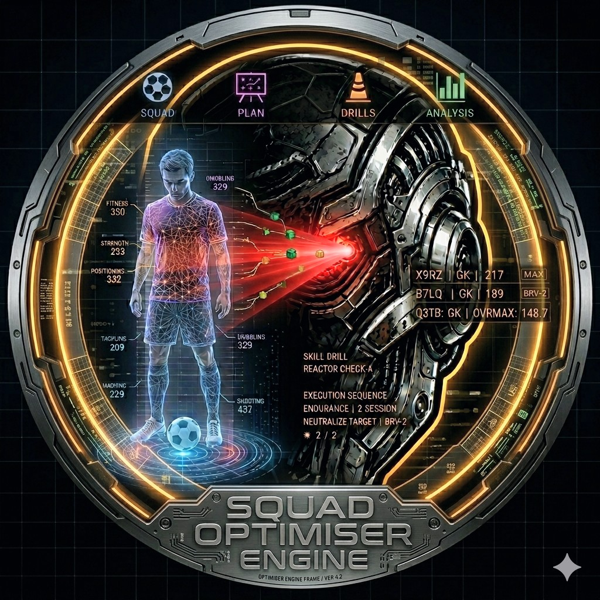

<div align="center">
  
</div>

<div align="center">

# 🔴 AIntegrity Squad Optimiser


**The Manager's Dilemma:** *Which player, which drills, which tier — and what OVR can they realistically reach?*

**AIntegrity Squad Optimiser gives you an empirically calibrated projection before you commit a single in-game asset.** The model is built from real game observations (not community guesses), but calibration is ongoing — confirmed constants are validated against screenshots; unconfirmed constants are clearly labelled in [`CLAUDE.md`](./CLAUDE.md).

🔒 *All calculations run entirely on-device. No accounts, no servers, no API calls.*

</div>

---

## ✨ Core Capabilities

- 🎯 **Calibrated OVR Projections** — Models age, role, stat profile, and talent tier to project OVR outcomes for any combination of drill plans, coaching sessions, and tier upgrades — before you spend anything. Core constants (OVR formula, cost curve shape, age 18–20 and 26–28 brackets, Normal talent) are empirically confirmed from game screenshots. Several talent tiers and mid-range age brackets are still being validated — projections show a gain range, not a single guaranteed number.
- 📸 **Instant OCR Scanning** — Tap **SCAN PLAYER CARD** to read all 15 stats, OVR, age, role, and tier straight from a screenshot. No manual entry. Coach preview screens can also be scanned to auto-fill session details.
- 📈 **Drill ROI Ranking** — All 40 drills ranked by return on investment for the selected player and Fan Club level. Zero-drain detection at L4 + Very Easy.
- 🔗 **Sequential Planning** — Chain drill plans, coaching sessions, tier upgrades, and restorers into one sequential plan with a per-step OVR breakdown in the Results hub.

📡 *Post-build updates deploy via EAS OTA — no app store submission required.*

---

## 🗺️ The Workflow

**📋 SQUAD** — The roster overview. Scan a player card screenshot to instantly add a player, or tap to edit manually. Includes a one-step revert to undo applied gains.

**⚙️ PLAN** — Single-player projection tool. Select drills, set tier target, add restorers → get a step-by-step OVR breakdown.

**💊 DRILLS** — All 40 drills ranked by ROI for the selected player. Fan Club level selector. Zero-drain detection. Build and save drill presets, then **push to Results** to include them in your combined plan.

**🧑‍🏫 COACHES** — Scan a coach preview screenshot to auto-fill session count and stats. Project the OVR gain from the coaching block. Apply to player card or save to history for import into Results.

**✅ RESULTS** — The combined plan hub. Import drill plans from history + coaching sessions from history, add a tier upgrade and condition restorers, then PROJECT to see the full sequential OVR chain. One button applies the complete plan to the player card.

> 🎨 **Visual Interface:** Stats use fixed colour-coding across every screen — DEF 🔵 `#4A7FC1`, ATT 🟣 `#7C3AED`, PHY 🟠 `#C05621`. Essential (white) stats display at full opacity; secondary (grey) stats are dimmed.

---

## ⚠️ The One Rule

> **Always drill before tier upgrade.**
>
> Tier permanently raises base stat values — coaching and drilling afterwards costs more XP per gain. Run all drills and coaching first to maximise total OVR gain per resource unit.

The Results tab enforces this ordering in every projection it generates: Drill Plans → Coach Sessions → Tier → Restorers.

---

## 💻 Quick Start

> Requires a **development build** — on-device OCR cannot run in Expo Go.

```bash
npm install
npx expo start
```

Device build: `npx eas build --profile development --platform android`

OTA updates push automatically on merge to `main`. An `EXPO_TOKEN` secret must be set in the repository for EAS to deploy.

---

## 🧠 Architecture & Documentation

The core logic — XP cost model, OVR projection formulas, role weight tables, and condition drain calculations — is reverse-engineered from real in-game data. Core constants are empirically confirmed; some talent multipliers and age brackets are still in calibration (see [`CLAUDE.md`](./CLAUDE.md) for the current status of every constant).

| Doc | Contents |
|---|---|
| [`WHITEPAPER.md`](./WHITEPAPER.md) | Formula derivations, XP calibration data, role weights, tier models, OCR system mechanics |
| [`FORMULAS.md`](./FORMULAS.md) | Concise formula reference with worked examples |
| [`DESIGN.md`](./DESIGN.md) | UI/visual design conventions — safe-to-edit vs logic-critical files |
| [`DEVLOG.md`](./DEVLOG.md) | Sprint-by-sprint build history and changelogs |
| [`HANDOVER.md`](./HANDOVER.md) | Complete file map, database schemas, and deployment instructions |
| [`KNOWN_ISSUES.md`](./KNOWN_ISSUES.md) | Open bugs and resolved issue tracking |

---

## ⚠️ Disclaimer

Unofficial and unaffiliated with any game developer or publisher. No game assets or proprietary data utilised. All calibration relies on publicly observable game behaviour. Strictly for personal, non-commercial use.
